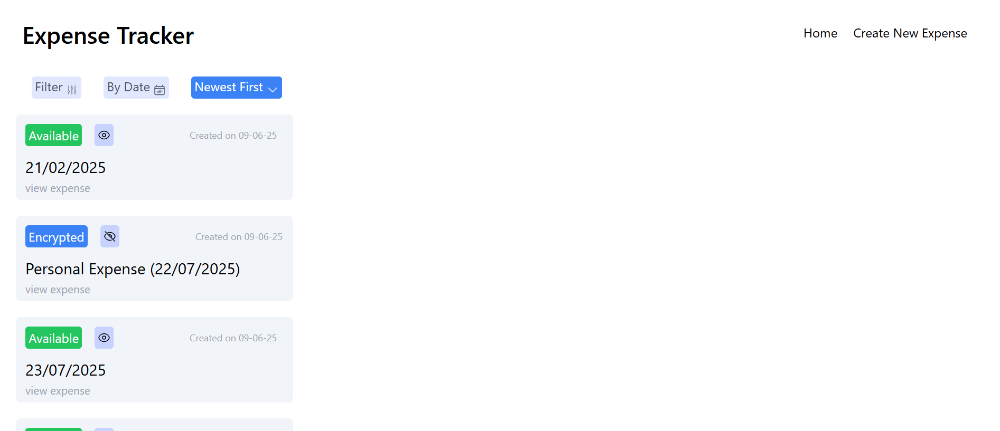

# 💸 Expense Tracker

A secure and feature-rich full-stack expense tracking web application where users can log in, track daily expenses, encrypt entries, and share them with others — all with support for Google OAuth, JWT authentication, and MongoDB relationships.


## 🚀 Live Demo

🌐 [Live App on Render](https://your-render-link-here.com)  
_(Update this once deployed)_


## 🖼️ Screenshot




## 🔧 Tech Stack

- HTML
- Tailwind CSS
- JavaScript
- Node.js
- Express.js
- MongoDB (with reference relationships)
- Google OAuth 2.0
- JWT Authentication
- Middleware architecture


## ✨ Features

- 👤 User Authentication (Sign up, Login, Google OAuth)
- 🔐 JWT-based session management
- 🧾 Create, edit, and delete expenses
- 🔐 Encrypt expenses with a password
- 📤 Share expenses (public/private option)
- 📅 View expenses in a timeline
- 🎯 Middleware usage for route protection
- 📦 Reference schema relationships in MongoDB


## 🛠️ Getting Started

### ⚙️ Prerequisites

- Node.js and npm installed
- MongoDB running locally or via Atlas


### 📦 Installation

1. **Clone the repository**

```bash
git clone https://github.com/Lipsa0710/EXPENSE-TRACKER-FULLSTACKWEBSITE.git
cd expense-tracker
